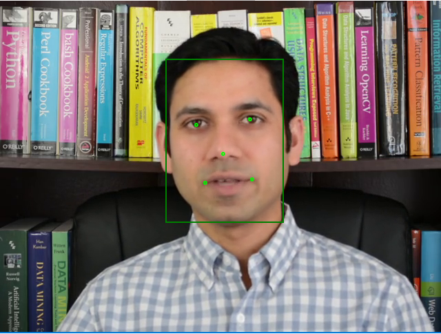

# Face Detection

## Use Case and High-Level Description

Face detection is a well-known use case. In this skill, OpenVINO™ based AI inference is used to detect multiple faces along with corresponding facial landmark feature locations. In addition, a confidence score for detection is also available as output.

## Example



## Inputs

<ol style="list-style-type: circle">
<li>Any size image with BGRA (8 bit) color format</li>
</ol>

## Outputs

<ol style="list-style-type: circle">
<li>Number of faces detected</li>
<li>Face rectangle(s) co-ordinates normalized with respect to input image dimensions {Left.x, Top.y, Right.x, Bottom.y}, range [0, 1.0]. There can be a maximum of 200 faces detected. For each of the faces, below facial landmarks are also provided as output.</li>
<li>Left eye co-ordinates normalized with respect to input image dimensions {x, y}, range [0, 1.0]</li>
<li>Right eye co-ordinates normalized with respect to input image dimensions {x, y}, range [0, 1.0]</li>
<li>Left lip corner co-ordinates normalized with respect to input image dimensions {x, y}, range [0, 1.0]</li>
<li>Right lip corner co-ordinates normalized with respect to input image dimensions {x, y}, range [0, 1.0]</li>
<li>Nose tip co-ordinates normalized with respect to input image dimensions {x, y}, range [0, 1.0]</li>
<li>Confidence score for face detection, range [0, 1.0].</li>
</ol>

## API Specification

For details on Windows\* Vision Skills API, please refer to Microsoft\* <a href="https://docs.microsoft.com/en-us/windows/ai/windows-vision-skills/important-api-concepts" target="_blank">documentation</a>. Face detection skill implements three components:

<ol style="list-style-type: circle">
<li><a class="el" href="#facedetectiondescriptor">FaceDetectionDescriptor</a></li>
<li><a class="el" href="#facedetectionskill">FaceDetectionSkill</a></li>
<li><a class="el" href="#facedetectionbinding">FaceDetectionBinding</a></li>
</ol>

### FaceDetectionDescriptor

Implements Microsoft::AI::Skills::SkillInterfacePreview::ISkillDescriptor.

#### FaceDetectionDescriptor

Constructor for face detection descriptor runtime class component.

```csharp
FaceDetectionDescriptor()

Parameters: None

Returns: Microsoft::AI::Skills::SkillInterfacePreview::ISkillDescriptor as Intel::AI::Skills::FaceDetection::FaceDetectionDescriptor
```
&NewLine;

#### Information

Returns structure containing information about the skill which includes name, description, author, publisher and version.

```csharp
SkillInformation Information()

Parameters: None

Returns: SkillInformation information
```
&NewLine;

#### InputFeatureDescriptors

Returns the set of input features used by the skill.

```csharp
IVectorView<ISkillFeatureDescriptor> InputFeatureDescriptors()

Parameters: None

Returns: IVectorView<Microsoft::AI::Skills::SkillInterfacePreview::ISkillFeatureDescriptor> inputFeatures
```
&NewLine;

#### OutputFeatureDescriptors

Returns the set of output features provided by the skill.

```csharp
IVectorView<ISkillFeatureDescriptor> OutputFeatureDescriptors()

Parameters: None

Returns: IVectorView<Microsoft::AI::Skills::SkillInterfacePreview::ISkillFeatureDescriptor> outputFeatures
```
&NewLine;

#### GetSupportedExecutionDevicesAsync

Returns a list of devices of hardware accelerators available on the platform which can be used to execute the skill logic.

```csharp
IAsyncOperation<IVectorView<ISkillExecutionDevice>> GetSupportedExecutionDevicesAsync()

Parameters: None

Returns: IVectorView<Microsoft::AI::Skills::SkillInterfacePreview::ISkillExecutionDevice> outputFeatures
```
&NewLine;

#### CreateSkillAsync

Instantiates the face detection skill. The execution device is automatically selected by the skill.

```csharp
IAsyncOperation<ISkill>CreateSkillAsync()

Parameters: None

Returns: Microsoft::AI::Skills::SkillInterfacePreview::ISkill faceDetectionSkill
```
&NewLine;

#### CreateSkillAsync (executionDevice)

Instantiates the face detection skill using the executionDevice provided by the user.

```csharp
IAsyncOperation<ISkill>CreateSkillAsync(ISkillExecutionDevice executionDevice)

Parameters: Microsoft::AI::Skills::SkillInterfacePreview::ISkillExecutionDevice executionDevice

Returns: Microsoft::AI::Skills::SkillInterfacePreview::ISkill faceDetectionSkill
```
&NewLine;

### FaceDetectionSkill

Implements Microsoft::AI::Skills::SkillInterfacePreview::ISkill.

#### CreateSkillBindingAsync

Instantiates the face detection binding object.

```csharp
IAsyncOperation<ISkillBinding> CreateSkillBindingAsync()

Parameters: None

Returns: Microsoft::AI::Skills::SkillInterfacePreview::ISkillBinding as Intel::AI::Skills::FaceDetection::FaceDetectionBinding
```
&NewLine;

#### EvaluateAsync

Executes the skill logic using input features provided by the binding object.

```csharp
IAsyncAction EvaluateAsync(ISkillBinding const binding)

Parameters: Intel::AI::Skills::FaceDetection::FaceDetectionBinding binding

Returns: Asynchronous method with no direct return value
```
&NewLine;

### FaceDetectionBinding

Implements Microsoft::AI::Skills::SkillInterfacePreview::ISkillBinding. The face detection binding is created by FaceDetectionSkill object.

#### SetInputImageAsync

Uses the VideoFrame object (frame) and binds it to the input. This is the image frame on which face detection is performed.

```csharp
IAsyncAction SetInputImageAsync(VideoFrame const frame)

Parameters: Windows::Media::VideoFrame frame

Returns: Asynchronous method with no direct return value
```
&NewLine;

#### IsFaceFound

Returns true if even a single face is found in the image, false if no face detected.

```csharp
Boolean IsFaceFound()

Parameters: None

Returns: true if face found, false otherwise
```
&NewLine;

#### FaceBB

Returns bounding box or face rectangle for the face at the given index.

```csharp
IVectorView<float> FaceBB(int32_t index)

Parameters: int32_t index to specify which face rectangle from the list of identified faces to get

Returns: A 4-element float vector with face rectangle co-ordinates normalized with respect to input image dimensions {Left.x, Top.y, Right.x, Bottom.y}, range [0, 1.0].
```
&NewLine;

#### FaceLandmarkLeftEye

Returns left eye co-ordinates for the face at the given index.

```csharp
IVectorView<float> FaceLandmarkLeftEye(int32_t index)

Parameters: int32_t index to specify the face from the list of identified faces

Returns: A 2-element float vector with left eye co-ordinates normalized with respect to input image dimensions {x, y}, range [0, 1.0]
```
&NewLine;

#### FaceLandmarkRightEye

Returns right eye co-ordinates for the face at the given index.

```csharp
IVectorView<float> FaceLandmarkRightEye(int32_t index)

Parameters: int32_t index to specify the face from the list of identified faces

Returns: A 2-element float vector with right eye co-ordinates normalized with respect to input image dimensions {x, y}, range [0, 1.0]
```
&NewLine;

#### FaceLandmarkMouthLeft

Returns left lip corner co-ordinates for the face at the given index.

```csharp
IVectorView<float> FaceLandmarkMouthLeft(int32_t index)

Parameters: int32_t index to specify the face from the list of identified faces

Returns: A 2-element float vector with left lip corner co-ordinates normalized with respect to input image dimensions {x, y}, range [0, 1.0]
```
&NewLine;

#### FaceLandmarkMouthRight

Returns right lip corner co-ordinates for the face at the given index.

```csharp
IVectorView<float> FaceLandmarkMouthRight(int32_t index)

Parameters: int32_t index to specify the face from the list of identified faces

Returns: A 2-element float vector with right lip corner co-ordinates normalized with respect to input image dimensions {x, y}, range [0, 1.0]
```
&NewLine;

#### FaceLandmarkNose

Returns nose tip co-ordinates for the face at the given index.

```csharp
IVectorView<float> FaceLandmarkNose(int32_t index)

Parameters: int32_t index to specify the face from the list of identified faces

Returns: A 2-element float vector with nose tip co-ordinates normalized with respect to input image dimensions {x, y}, range [0, 1.0]
```
&NewLine;

## Application

The application developer starts with a C# XAML form based project. As a first step, s/he needs to ingest face detection skill by installing the nuget package from appropriate location. This makes all face detection skill APIs available to use. The GUI design is up to the application developer. Below pseudo code show how the skill APIs can be used to perform face detection.

```csharp
using Intel.AI.Skills.FaceDetection;
using Microsoft.AI.Skills.SkillInterfacePreview;

FaceDetectionDescriptor skillDescriptor = null;
IReadOnlyList<ISkillExecutionDevice> availableExecutionDevices = null;
FaceDetectionSkill skill = null;
FaceDetectionBinding binding = null;
int selectedDeviceId = 0;

// Instantiate skill descriptor
skillDescriptor = new FaceDetectionDescriptor();

// Get list of available execution devices
availableExecutionDevices = await skillDescriptor.GetSupportedExecutionDevicesAsync();

// Initialize skill with the selected execution device
skill = await skillDescriptor.CreateSkillAsync(availableExecutionDevices[selectedDeviceId]) as FaceDetectionSkill;

// Instantiate skill binding object
binding = await skill.CreateSkillBindingAsync() as FaceDetectionBinding;

// Set input image frame which can be from a camera feed or a file read
await binding.SetInputImageAsync(frame);

// Run face detection skill with the binding object
await skill.EvaluateAsync(binding);

// Consume result
var scores = (m_paramsSkillObj.m_binding["NumberOfFaces"].FeatureValue as SkillFeatureTensorFloatValue).GetAsVectorView();

// Number of faces is the first element of scores vector
int numFaces = (int)scores[0];

// Get probability of detection
var prob = (m_paramsSkillObj.m_binding["FaceConfidence"].FeatureValue as SkillFeatureTensorFloatValue).GetAsVectorView();


if (numFaces != 0)
{
    for (int i = 0; i < numFaces; i++)
    {
    	// Display face rectangle and landmark points using application's implementation of a renderer
    	ShowRectangle(binding.FaceBB(i));
    	ShowPoint(binding.FaceLandmarkLeftEye(i));
    	ShowPoint(binding.FaceLandmarkRightEye(i));
    	ShowPoint(binding.FaceLandmarkMouthLeft(i));
    	ShowPoint(binding.FaceLandmarkMouthRight(i));
    	ShowPoint(binding.FaceLandmarkNose(i));
    }
}
```

## Known Issues

This skill has only been enabled for CPU. It is expected to be released with GPU support in future versions. 

----

##### *Legal Information: Other names and brands may be claimed as the property of others.
